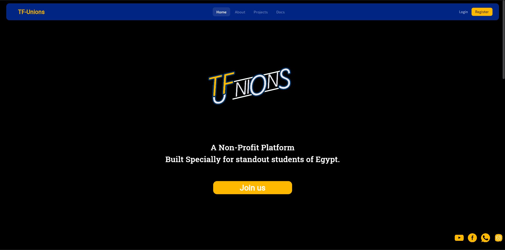
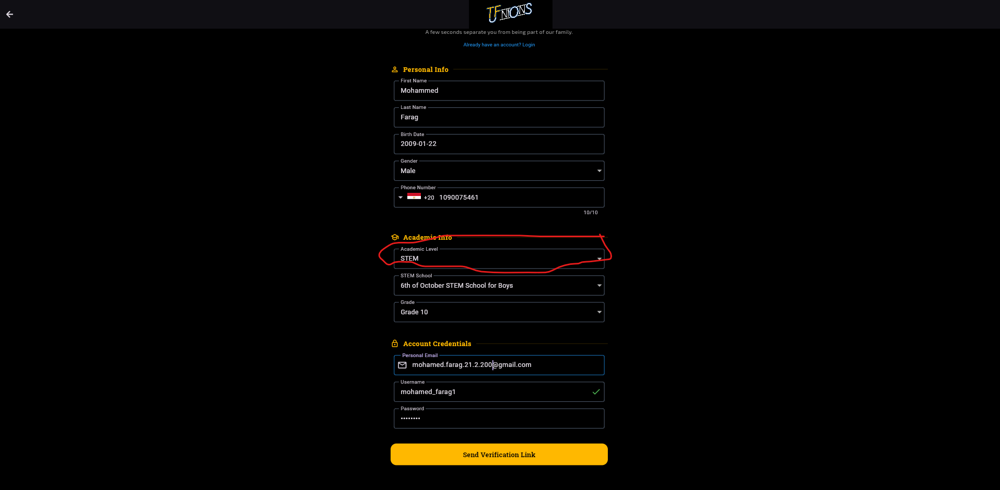
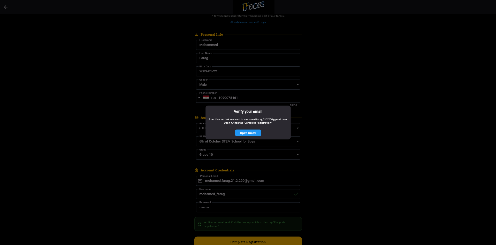
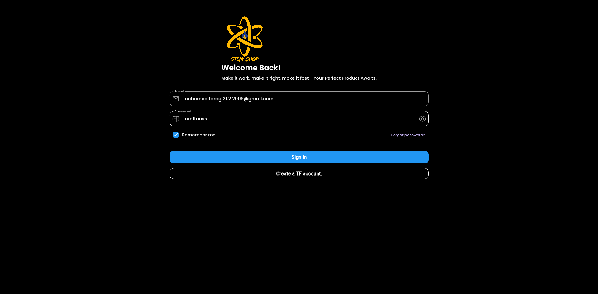
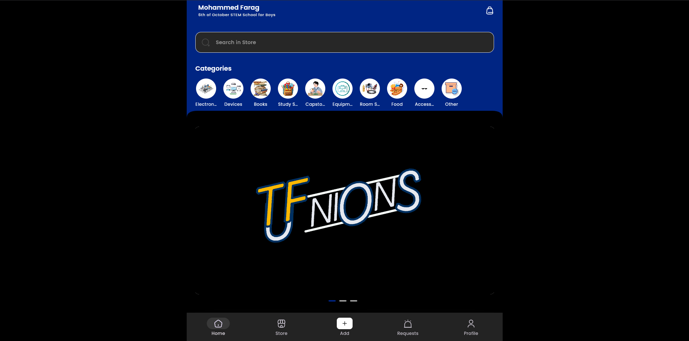

# STEM Shop

> STEM Shop is a flutter application built to help stem students to buy and sell their products on thier schools to save time and costs.

---
# NOTE IF YOU WANT A DEMO ACCUONT TO TEST THIS USE THIS EMAIL AND PASSWORD

## EMAIL : mohamed.farag.21.2.2009@gmail.com
## PASSWORD : mmffaass1

## OR IF YOU GET THE FULL EXPERINCE YOU HAVE TO CHOOSE STEM IN THE ACADEMIC LEVEL WHILE CREATING THE TF ACCOUNT.

- first Goto TF-Unions Website

- second Register your account (jsut make sure that you choosed STEM as an Academic level)

- third verify your email, the mail will be in the spam

- 4th login with your new credentials

- 5th you can now login and test your project

## Overview

STEM Shop is a Flutter mobile app built under the **TF Unions** platform. Students can list products for sale, browse their school's marketplace, submit item requests, and contact sellers directly via WhatsApp.

Each student only sees products and requests from their own school (school-scoped).

---

## Features

- Firebase Authentication (email/password)
- Home screen with school-scoped product feed
- Store screen with filtering system to reach the exact needed product
- seller screnn to monitor and sell you products
- ability to edit the products as a seller
- cart screen to save what you want
- Ability to chat the seller once if you buy several products from him
- Seller order confirmation / decline flow
- Seller listings management (add, edit, mark as sold, delete)
- Item requests (school-scoped or all STEM schools)
- User profile with photo upload

---

## Tech Stack

| Layer            | Technology         |
| ---------------- | ------------------ |
| Framework        | Flutter            |
| State Management | GetX               |
| Database         | Firebase Firestore |
| Authentication   | Firebase Auth      |
| Image Storage    | Cloudinary         |
| Image Picker     | image_picker       |
| Deep Links       | url_launcher       |

---

## To Get start as a user

just you need to create a TF account to be able to use the app

## To Get Start as developer

```bash
# Clone the repo
git clone https://github.com/Mohammed-Farag-AbuZaid/STEM-Shop
cd stem-shop

# Install dependencies
flutter pub get

# Run the app
flutter run
```

## Project Structure

lib/

├── app.dart

├── main.dart

├── navigation_menu.dart

├── data/

│ ├── repositories/

│ │ ├── authentication_repositories.dart

│ │ ├── products/product_repository.dart

│ │ ├── requests/request_repository.dart

│ │ └── user/user_repository.dart

│ └── services/

│ └── cloudinary_storage_service.dart

├── features/

│ ├── authentication/

│ ├── personalization/

│ │ └── controllers/user_controller.dart

│ └── shop/

│ ├── controllers/

│ │ ├── categories_controller.dart

│ │ ├── home_page_controller.dart

│ │ ├── products_controller.dart

│ │ ├── cart_controller.dart

│ │ ├── order_controller.dart

│ │ ├── seller_order_controller.dart

│ │ └── requests_controller.dart

│ ├── models/

│ │ ├── product_model.dart

│ │ ├── category_model.dart

│ │ ├── request_model.dart

│ │ └── order_model.dart

│ └── screens/

│ ├── home/

│ ├── store/

│ ├── search/

│ ├── product_details/

│ ├── all_products/

│ ├── category/

│ ├── add/

│ └── requests/

└── common/

└── widgets/

## colaboration

This project is result of colaboation between two developer (Mohammed Farag & Mohammed Abd-Alghany).

## Libraries & Packages

| Package                                                                 | Version | Purpose                                                 |
| ----------------------------------------------------------------------- | ------- | ------------------------------------------------------- |
| [get](https://pub.dev/packages/get)                                     | ^4.x.x  | State management, navigation, dependency injection      |
| [firebase_core](https://pub.dev/packages/firebase_core)                 | ^3.x.x  | Firebase initialization                                 |
| [firebase_auth](https://pub.dev/packages/firebase_auth)                 | ^5.x.x  | Email/password authentication                           |
| [cloud_firestore](https://pub.dev/packages/cloud_firestore)             | ^5.x.x  | NoSQL database                                          |
| [firebase_storage](https://pub.dev/packages/firebase_storage)           | ^12.x.x | (installed but unused — images go via Cloudinary)       |
| [http](https://pub.dev/packages/http)                                   | ^1.x.x  | Cloudinary image upload via HTTP POST                   |
| [image_picker](https://pub.dev/packages/image_picker)                   | ^1.x.x  | Pick images from gallery for product/profile upload     |
| [carousel_slider](https://pub.dev/packages/carousel_slider)             | ^5.x.x  | Product image carousel on details screen                |
| [cached_network_image](https://pub.dev/packages/cached_network_image)   | ^3.x.x  | Efficient network image loading with cache              |
| [get_storage](https://pub.dev/packages/get_storage)                     | ^2.x.x  | Lightweight local key-value storage                     |
| [iconsax](https://pub.dev/packages/iconsax)                             | ^0.x.x  | Icon set used throughout the UI                         |
| [readmore](https://pub.dev/packages/readmore)                           | ^3.x.x  | Expandable "Read more / Show less" text                 |
| [url_launcher](https://pub.dev/packages/url_launcher)                   | ^6.x.x  | Launch WhatsApp and external product links              |
| [intl_phone_field](https://pub.dev/packages/intl_phone_field)           | ^3.x.x  | International phone number input with country picker    |
| [flutter_rating_bar](https://pub.dev/packages/flutter_rating_bar)       | ^4.x.x  | Star rating display on product details                  |
| [flutter_native_splash](https://pub.dev/packages/flutter_native_splash) | ^2.x.x  | Native splash screen on app launch                      |
| [mobile_scanner](https://pub.dev/packages/mobile_scanner)               | ^6.x.x  | QR/barcode scanner                                      |
| [share_plus](https://pub.dev/packages/share_plus)                       | ^10.x.x | Share product links via system share sheet              |
| [package_info_plus](https://pub.dev/packages/package_info_plus)         | ^8.x.x  | Read app version and build number                       |
| [geolocator](https://pub.dev/packages/geolocator)                       | ^13.x.x | Device location (used for school detection or delivery) |
